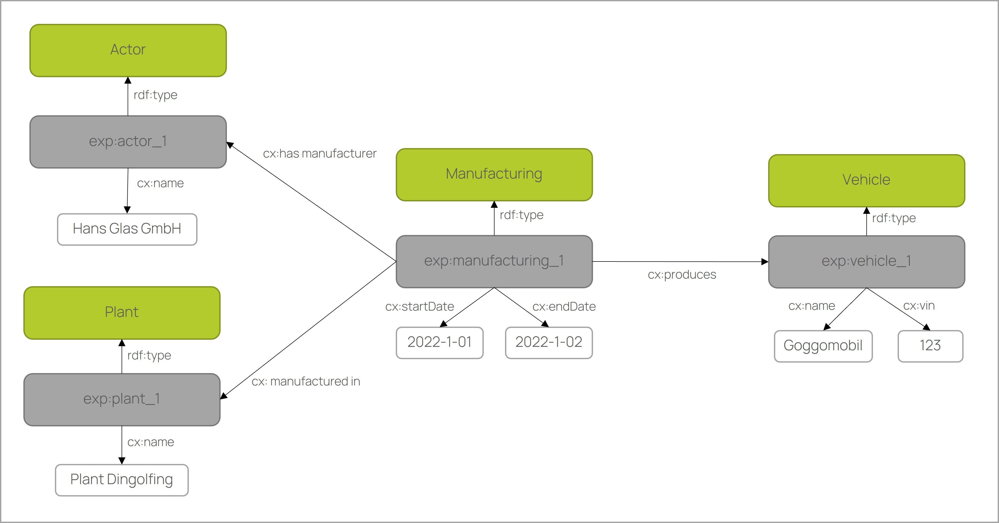

# CX - 0000 Ontology Models in Catena-X v.1.0.0

## TABLE OF CONTENTS

- [CX - 0000 Ontology Models in Catena-X v.1.0.0](#cx---0000-ontology-models-in-catena-x-v100)
  - [TABLE OF CONTENTS](#table-of-contents)
  - [ABOUT THIS DOCUMENT \& MOTIVATION](#about-this-document--motivation)
  - [DISCLAIMER \& LIABILITY](#disclaimer--liability)
  - [REVISIONS \& UPDATE](#revisions--update)
  - [COPYRIGHT \& TRADEMARKS](#copyright--trademarks)
  - [ABSTRACT](#abstract)
  - [1. INTRODUCTION](#1-introduction)
    - [1.1 AUDIENCE \& SCOPE](#11-audience--scope)
    - [1.2 CONTEXT](#12-context)
    - [1.4 CONFORMANCE](#14-conformance)
    - [1.5 PROOF OF CONFORMITY](#15-proof-of-conformity)
    - [1.7 TERMINOLOGY](#17-terminology)
  - [2 MAIN CONTENT](#2-main-content)
    - [2.1 MODELLING CONCEPT](#21-modelling-concept)
      - [2.1.1 Modelling with ontologies](#211-modelling-with-ontologies)
      - [2.1.2 Activity-centred modelling](#212-activity-centred-modelling)
      - [2.1.3 Core and domain ontologies](#213-core-and-domain-ontologies)
      - [2.1.4 Data binding](#214-data-binding)
      - [2.1.5 Data query](#215-data-query)
      - [2.1.6 Federated query](#216-federated-query)
    - [2.2 MODELLING GUIDELINES](#22-modelling-guidelines)
      - [2.2.1 Content modelling guidelines](#221-content-modelling-guidelines)
      - [2.2.2 Technical modelling guidelines](#222-technical-modelling-guidelines)
      - [2.2.3 Syntactical modelling guidelines](#223-syntactical-modelling-guidelines)
  - [3 REFERENCES](#3-references)
    - [3.1 NORMATIVE REFERENCES](#31-normative-references)
    - [3.2 NON-NORMATIVE REFERENCES](#32-non-normative-references)
  - [ANNEXES](#annexes)
    - [FIGURES](#figures)
    - [TABLES](#tables)

<br>

## ABOUT THIS DOCUMENT & MOTIVATION

<br>

## DISCLAIMER & LIABILITY

<br>

## REVISIONS & UPDATE

<br>

## COPYRIGHT & TRADEMARKS

<br>

## ABSTRACT

This standard gives fundamental guidelines to create ontology models for being used in Catena-X. It provides the semantic basis for the so called Knowledge Agent Approach that utilizes semantic web technologies for federated queries in data spaces (see Catena-X standard CX0084).

<br>

## 1. INTRODUCTION

Semantics is the art and science of understanding what data means. In the context of Catena-X this topic has a significant importance in the sense that data provider and consumer need to have the same understanding what data needs to be shared (see also [FAIR data](https://en.wikipedia.org/wiki/FAIR_data)). In the knowledge agent approach, ontologies are used to describe the semantics of data. Ontologies are similar to data models or data schemas in which the semantics and structure of data are described. In addition, ontologies provide a high degree of semantic expressiveness, i.e. formal semantics. This means that there is a logical system behind the ontologies. This allows automatic inference on data like "p-123" is_a part and part is_a physical object => "p-123" is_a physical object. Such inference enables strong typing of data. This way the machine can understand the meaning of the vocabulary 'part', that it is a physical object and not a document part or a design model part. It could be that the same vocabularies are used for different things in different data models. The formal semantics of ontologies can prevent such misunderstandings in data caused by synonymity or homonymity, etc. and lead to better collaboration and interoperability between data space participants.

In applying the ontology-based data modelling in Catena-X, the following fundamentals should be achieved:
- Maximise Semantics
- Reduce Complexity
- Minimise Redundancy

The ontology-based data modelling in Knowledge Agent Approach is explained in detail in section [2.1 MODELLING CONCEPT](#21-modelling-concept).

<br>

### 1.1 AUDIENCE & SCOPE

> _This section is non-normative_

This standard aims at everyone who creates or processes ontology models in Catena-X. In particular:

- **Business Application Providers** that create/request specific models/ model extensions to make their application work (relevant for certification if solutions are based on knowledge agent approach for data processing).

- **Data Providers** that need to supply data based on given specification of an ontology model (not relevant for certification).

- **Enablement Service Providers** that offer data integration solutions, e.g. for mapping of ontology models to corporate-internal data models (relevant for certification if solutions for knowledge agent approach are provided).

- **Catena-X e.V.** will have a significant role of supervising ontology development (governance process for model development and respective quality criteria, not relevant for certification).

Created ontology models can be utilized as semantic basis for the so called "knowledge agent" approach to exchange data across Catena-X participants. This standard will reference required external standards. Furthermore, it will provide modelling guidelines that extend/restrict given W3C standards to decrease complexity and to make sure that the models are designed in a unified way compatible with CX0084 (knowledge agent standard).

<br>

### 1.2 CONTEXT

The knowledge agent approach uses the [Semantic Web standards](https://www.w3.org/2001/sw/wiki/Main_Page). The [Semantic Web](https://en.wikipedia.org/wiki/Semantic_Web) is the semantic extension of the Web. In the Web, the content of Web pages is exchanged in a document-based way (Web of Documents). This has the disadvantage that a direct access to a certain content of the documents is not possible. Therefore, a new concept was developed in which the contents of documents are decomposed into data and described by data models (Web of Data). At the same time, a query language was developed with which the desired content can be queried directly. In the Semantic Web, the data models are called ontologies, based on the philosophical meaning 'study of being', because the data on the Web is the digital representation of things in the real world. Semantic Web ontologies are formal languages in which data can be described unambiguously and without redundancy. This makes the ever-growing volumes of data on the web more manageable and usable to generate new knowledge. A good example is the [DBpedia project](https://en.wikipedia.org/wiki/DBpedia), which makes Wikipedia content available as data. In recent years, Semantic Web standards have been increasingly used in enterprises to create enterprise-wide [knowledge graphs](https://en.wikipedia.org/wiki/Knowledge_graph) to structure internal big data and make it queryable to create knowledge. This concept is implemented for Catena-X in the knowledge agent approach.

Semantic Web Standards used in knowledge agent approach

- [OWL 2 QL Profile](https://www.w3.org/TR/owl2-profiles/#OWL_2_QL) for modelling ontologies,
- [SKOS](https://www.w3.org/2004/02/skos/) for vocabularies,
- [RML](https://rml.io/specs/rml/) & [R2RML](https://www.w3.org/TR/2012/REC-r2rml-20120927/) for mapping data source model to asset model to provide data in an asset,
- [SHACL](https://www.w3.org/TR/shacl/) for data quality check and for describing which data is available in the asset and in which form,
- [RDF](https://www.w3.org/TR/rdf12-concepts/) for description and exchange of graph data, 
- [Turtle](https://www.w3.org/TR/turtle/) for persisting,
- [SPARQL](https://www.w3.org/TR/sparql11-query/) for querying data.

<br>

### 1.4 CONFORMANCE

As well as sections marked as non-normative, all authoring guidelines, diagrams,
examples, and notes in this specification are non-normative. Everything else in
this specification is normative.

The key words **MAY**, **MUST**, **MUST NOT**, **OPTIONAL**, **RECOMMENDED**,
**REQUIRED**, **SHOULD** and **SHOULD NOT** in this document document are to be
interpreted as described in BCP 14 [RFC2119] [RFC8174] when, and only when, they
appear in all capitals, as shown here.

<br>

### 1.5 PROOF OF CONFORMITY

> _This section is normative_

Model content MUST be modeled as described in the [2.1. MODELLING CONCEPT](#21-modelling-concept) section. Nevertheless, model content needs to be reviewed by Catena-X e.V and their given governance process. Thus, CAB (Conformity Assessment Bodies) will not review model content.

Model content MUST adhere to given guidelines in the [2.2 MODELLING GUIDELINES](#22-modelling-guidelines) section. The individual guidelines are additionally defined as **MUST** or **RECOMMENDED**. Nevertheless, model syntax needs to be reviewed by Catena-X e.V and their given governance process. Thus, CAB (Conformity Assessment Bodies) will not review model content.

<br>

### 1.7 TERMINOLOGY

> _This section is non-normative_

| Syntax      | Description |
| ----------- | ----------- |
| Attribute| An attribute represents a characteristic of an entity/class/individual, e.g. foaf:Person foaf:name "Max". An attribute is called 'owl:DatatypeProperty' in OWL     |
| Class| A class is a set of individuals with shared structure/properties, i.e. kinds of things        |
|Data Mapping |A data mapping connects the logical data model (ontology) with the underlying external physical data model (RDB schema)|
|Instance |An instance is an object of a class |
|Knowledge graph (KG) |A knowledge graph is a graph-structured database where knowledge is represented in the ontology and instances. There are two types of KGs: RDF (GraphDB, RDFox, AnzoGraph, Stardog) and Labeled Property Graphs (neo4j)|
|Literal |A literal represents a data value, i.e. an element with a data type (string or integer), e.g. foaf:Person foaf:name "Max"|
|Namespace|A namespace is the base URI: Example: http://www.w3.org/1999/02/22-rdf-syntax-ns# with the prefix rdf|
|Ontology|An OWL ontology is a semantic data model based on [description logic](https://en.wikipedia.org/wiki/Description_logic) that consists of classes, relations, attributes for a specific domain of interest/discourse|
|Relation |A relation represents how two individuals are connected/related, e.g. cx:Bob cx:knows cx:Tom. A relation is called 'owl:ObjectProperty' in OWL|
|Triple|A triple is statement consisting of subject-predicate-object that is defined by RDF|
|Uniform Resource Identifier (URI)|An URI is an unique identifier for a (web) resource|

<br>

## 2 MAIN CONTENT

> _This section is normative_

<br>

### 2.1 Modelling Concept
This section explains the concept of ontology-based data modelling of the knowledge agent approach. Furthermore, it is shown how the query of distributed data in dataspaces works on the basis of this concept.

<br>

#### **2.1.1 Modelling with Ontologies**

In the Knowledge Agent approach, the data is modelled with the Semantic Web Ontology language [OWL](https://www.w3.org/TR/2012/REC-owl2-primer-20121211/). This enables object-oriented modelling of domains with classes, attributes and relationships. Object-oriented modelling allows the modelling of a domain from general to specific by creating subclasses. The first step is to define the main classes that describe the domain. In the case of Catena-X, five main classes were defined.
- Activity: This class comprises actions that are intentionally performed by instances of the actor over the course of the product life cycle and result in state changes in physical and conceptual objects.
- Actor: This class comprises organization, device or people, either individually or in groups, who have the potential to perform intentional actions of kinds for which someone may be held responsible.
- Physical object: This class includes objects of a material nature, which are documentation units and have physical boundaries.
- Conceptual object: This class includes non-material products, human-produced data related to physical objects. The production of such information may have been supported by the use of technical tools.
- Place: The class Place is determined by reference to the position of objects such as buildings, cities, or special geographic markers.

<br>

<div align="center"  width="100%">
  
</div>

<br>

#### **2.1.2 Activity-centred Modelling**
Activity-centred or event-based modelling is a well-known approach (see also [CIDOC-CRM](https://www.cidoc-crm.org/)). Not all information is directly assigned to an entity. The classes actor, place, physical object and conceptual object are connected through activities. Instead of assigning all information to the physical object. This distributed representation has several advantages:
- The life cycles of products and documents are represented separately and clearly.
- The activities have a start and end date so that the data can be queried chronologically.
- The data can be viewed and queried from different perspectives.
  - Identifies all actors (e.g. companies) involved in an activity (e.g. manufacturing).
  - Identifies all activities performed on a physical object (vehicle).
  - Finds all activities that have been performed at a place.
  - Searches for all physical objects (e.g. material) used in an activity (e.g. manufacturing).
  - Search for conceptual objects related to a physical object in an activity.

<br>

<div align="center"  width="100%">
  
</div>

<br>

#### **2.1.3 Core and Domain Ontologies**
The concept described above is the basic modelling pattern in Knowledge Agent. We call it the [core ontology](https://github.com/catenax-ng/product-ontology/blob/main/ontology/core_ontology.ttl). Based on this ontology, specific domain ontologies can be modelled. A domain ontology can be created based on subclasses (e.g. Manufacturing is SubClassOf Activity), subrelations (e.g. has Manufacturer is SubPropertyOf has Participant) and subattributes. The domain ontology has the same structure as the core ontology, but can be extended to include additional classes.

Benefits of the basic modelling pattern:
- Easy for domain experts to understand and create new domain ontologies. 
- Data is represented in datasets using the same pattern.
- Data can be queried with general queries such as 'Get All Actors' or specific queries such as 'Get Manufacturer'. 

<br>

<div align="center"  width="100%">
  
</div>

<br>

#### **2.1.4 Data binding**
In the ontology-based approach, the data is serialised in graph structure using the Resource Description Framework (see [RDF](https://www.w3.org/TR/rdf12-concepts/)). Each node, also called a resource, is uniquely identified by a [URI](https://www.w3.org/wiki/URI). The edges are called property in RDF Graph because each relation forms a [subject-predicate-object triple](https://www.w3.org/wiki/SubjectPredicateObject). The nodes can be linked to other nodes (so-called object property). The relations used are from the Domain Ontology. At the same time, nodes can be linked to literals (so-called datatype property). With the property rdf:type, the nodes can be instantiated with domain classes. 

<br>
<div align="center"  width="100%">
  
</div>
<br>

The RDF graphs are stored in [RDF databases](https://www.w3.org/wiki/LargeTripleStores) (so-called triple store) and can be serialised in various formats such as xml, json, ttl, etc. Different data sources such as relational databases, XML, JSON and CSV files can be mapped to RDF graphs using standardised languages such as RML and R2RML. Based on the mapping, the data can be transformed or virtualised. Virtualisation allows the data to be processed as RDF graphs without transforming it and storing it in a different location. 

#### **2.1.5 Data Query**
The RDF graphs can be accessed using the SPARQL query language via a SPARQL HTTP protocol. SPARQL allows the definition of complex instance relationships and the search for the defined patterns in the RDF graphs.

General query example: Returns all physical objects and their name and activities.

~~~s
@prefix cx-core: <https://w3id.org/catenax/ontology/core#>
@prefix rdf: <http://www.w3.org/1999/02/22-rdf-syntax-ns#>
@prefix bmw: <https://www.bmw.de/catenax/data#>

select ?activity ?physicalObject
where {
  ?activity rdf:type cx:Activity.
  ?physicalObject rdf:type cx:PhysicalObject.
  ?physicalObject cx:name cx:PhysicalObject.
  ?activity cx:refersToPhysicalObject ?physicalObject.
}
~~~

Query result:

| ?activity   | ?physicalObject |?name|
| ----------- | ----------- | ----------- |
|bmw:manufacturing_1|bmw:vehicle_1|"THE 1"|

<br>

Specific query example: Returns all vehicles and their name and manufacturing activities.

~~~s
@prefix cx-core: <https://w3id.org/catenax/ontology/core#>
@prefix rdf: <http://www.w3.org/1999/02/22-rdf-syntax-ns#>
@prefix bmw: <https://www.bmw.de/catenax/data#>

select ?activity ?physicalObject
where {
  ?activity rdf:type cx:Manufacturing.
  ?physicalObject rdf:type cx:Vehicle.
  ?physicalObject cx:name cx:Vehicle.
  ?activity cx:refersToPhysicalObject ?physicalObject.
}
~~~

<br>

Query result is the same as the first one:

| ?activity   | ?physicalObject |?name|
| ----------- | ----------- | ----------- |
|bmw:manufacturing_1|bmw:vehicle_1|"THE 1"|
<br>

#### **2.1.6 Federated Query**
An important advantage of SPARQL is that multiple repositories can be accessed from a single query. This feature gives Catena-X the great advantage of being able to query distributed data in different assets at the same time.

<br>
<div align="center"  width="100%">
  
</div>
<br>


Federated query example: Returns all vehicle names from BMW Asset and for the same vehicles the names of the diagnosis results from ADAC Asset.

~~~s
@prefix cx-core: <https://w3id.org/catenax/ontology/core#>
@prefix rdf: <http://www.w3.org/1999/02/22-rdf-syntax-ns#>

select ?vehicleName ?diagnosisResultName
where {

  # BMW Asset
  SERVICE <https://www.bmw.de/catenax/asset_1> {

    ?physicalObject rdf:type cx:Vehicle.
    ?physicalObject cx:name ?vehicleName.

    #ADAC Asset
    SERVICE <https://www.adac.de/catenax/asset_1> {

      ?physicalObject rdf:type cx:Vehicle.
      ?activity cx:refersToConceptualObject ?conceptualObject.
      ?conceptualObject cx:name ?diagnosisResultName.

    }
  }
}
~~~

Federated Query result:

| ?vehicleName   | ?diagnosisResultName |
| ----------- | ----------- |
|"THE 1"|"Cylinder misfire"|

<br>

### 2.2 Modelling Guidelines

To facilitate the modelling process, a joint knowledge acquisition workshop with stakeholders (data producers, consumers, subject matter experts) is helpful. This workshop should have the following objectives:

- Specify the ontology domain and scope
- Collect the requirements, data sources
- Prevent misunderstanding and moderate the expectations
- Collect relevant classes, relations, attributes

This section defines modelling guidelines that help develop compliant domain ontologies based on the Core Ontology. New ontologies or adaptation of existing ontologies are created upon request of Catena-X use cases.

<br>

#### **2.2.1 Content Modelling Guidelines**

In order to effectively develop useful and reusable ontologies, all of the following modelling guidelines must be followed.

- G11 Define business requirments 
  - Who knows, produces, consumes the data?
  - State the business questions and define Asset queries
  - Define the source data needed for the asset.
- G12 Model Scope and dependencies
  - Identify the generic classes for source data from the Core Ontology.
  - Identify the specific classes for source data from existing domain ontologies.
  - Avoid ontology redundancy. Modularity and reuse are important design principles.
  - Check if parts of the needs are covered in existing ontologies
  - Consider also extending different ontologies in a new one (modularity)
  - Define import dependency in ontologies
- G13 Create Domain Ontology
  - Import core ontology.
  - Define domain, i.e. the ontology domain, e.g. 'Vehicle'
  - Use a short, unambiguous domain name so that everyone can easily understand the meaning
  - Use a specific domain name if helps to understand the context better
  - Define turtle file name followed by 'ontology' in snake_case
  - Specify title of ontology followed by 'Ontology' in title case with whitespaces (domain) + ' Ontology', e.g. 'Vehicle Ontology'
  - Specify version, use three integers separated with two dots
  - Specify author, full name(s) of main responsible(s) comma separated
  - Specify contributor, full name(s) domain expert(s) comma separated
  - Specify description, i.e. state business problem and business questions
- G14 Create Classes
  - Check & reuse if class already exists in core ontology, check also for the synonyms
  - Specify the (machine-readable) identifier in English
  - Use only noun or a phrase of nouns in lower case with whitespaces
  - Use generic terms here, so that everyone can easily understand the meaning
  - Don't acronyms and abbreviations here
  - Specify the (human-readable) name in English and German
  - Use only noun or a phrase of nouns in title case with whitespaces
  - Use business terms here, so that the business department can easily understand the meaning
  - Specify the definition in English, only short sentence
  - Specify the synonyms in English and German
- G15 Create Relations
  - Check & reuse if realtion already exists in core ontology, check also for the synonyms
  - Specify the (machine-readable) identifier in English
  - Use a complete verb phrase in lower case with whitespaces, e.g. 'is part of'
  - Don't invent new relations, instead reuse existing relations
  - Specify the domain
  - Specify the range
  - Specify the inverse relation
- G16 Create Attributes
  - Check & reuse if attribute already exists in core ontology, check also for the synonyms
  - Specify the (machine-readable) identifier in English
  - Use a noun or a phrase of nouns in lower case with whitespaces (similar to column names)
  - Use generic terms here, so that everyone can easily understand the meaning
  - Use class name as specifier, if the attribute is specific to the class
  - Don't use acronyms and abbreviations here
  - Don't use verbs in attribute identifiers
  - Specify the (human-readable) name in English and German
  - Use a noun or a phrase of nouns in title case with whitespaces (similar to column names)
  - Use business terms here, so that the business department can easily understand the meaning
  - Don't use verbs in attribute names
  - Specify the definition in English
  - Specify the range


<br>

#### **2.2.1 Technical Modelling Guidelines**

All ontology models in Catena-X MUST comply with the following guidelines:

- G21 Export Ontologie from editor as turtle file: (domain) + '_ontology.ttl', e.g. 'vehicle_ontology.ttl' 
- G22 All classes, relations, attributes are uniquely defined in an ontology.
- G23 Redundant definitions are resolved.
- G24 Check for conflicts with Reasoner 
- G25 Scan your ontology with the [Ontology Pitfall Scanner](https://oops.linkeddata.es/webservice.html)
- G26 Merge domain ontologies if necessary for the asset

<br>

#### **2.2.3 Syntactical Modelling Guidelines**

All ontology models in Catena-X MUST comply with the following guidelines:

-  G31 General
    - Avoid bad naming, consider interpretation and context
    - Make names more specific if it has more than one interpretation
    - Avoid omitting definitions or bad definitions
    - Try to name examples, since it supports in the semantics

- G32 Identifiers/URIs
  -  Use only alphanumeric characters [A-z0-9] (IRI/URI standard)
  -  Do not use acronyms or abbreviations allowed in URIs
  -  Use PascalCase/UpperCamelCase for classes (RDF/OWL standard)
  -  Use camelCase/lowerCamelCase for relations and attributes (RDF/OWL standard)

- G34 Naming Conventions
  - Use only alphanumeric characters with whitespaces [A-z0-9 ] + Umlaute (ÄäÖöÜüß)
  - Use acronyms or abbreviations if it helps the understanding of the data for the consumers
  - Use title case with whitespaces for classes and attributes for better human-readability
  - Use lower case with whitespaces for relations

    |convention|identifier|name_en|name_de|
    | ----------- | ----------- | ----------- | ----------- |
    |language|English|English|German|
    |readability|machine-readable|human-readable|human-readable|
    |terms|generic terms|business terms|business terms|
    |character range|[A-z0-9]|[A-z0-9 -]|[A-z0-9 -ÄäÖöÜüß]|
    |separator|none|whitespace|whitespace|
    |class case|PascalCase|Title Case|Title Case|
    |relation case|camelCase|lower case|lower case|
    |attribute case|camelCase|Title Case|Title Case|
    |acronyms|no|yes|yes|

- G35 Language
  - Use short, meaningful, unambiguous names
  - Note: natural language exhibits ambiguity, inaccuracy, uncertainty, vagueness
  - Use both English and German names, since it improves the semantics
  - Don't use vague terms, e.g. model, data, ...
  - Use only US English terms and name British terms as synonyms, e.g. meter/metre

<br>

## 3 REFERENCES

(to be completed)

<br>

### 3.1 NORMATIVE REFERENCES

```text
    [Optional] - Links to related Catena-X or external standards that need to be
    meet in order to fulfil this standard. If no external standards need to be
    met, leave empty.
```

<br>

### 3.2 NON-NORMATIVE REFERENCES

> _This section is non-normative_

```text
    [Optional] – Links to further documentation that may help to understand the 
    standard but isn’t relevant for conformity assessment
```

<br>

## ANNEXES

(to be completed)

<br>

### FIGURES

> _This section is non-normative_

```text
    [OPTIONAL] Add figures here if necessary
```

<br>

### TABLES

> _This section is non-normative_

```text
    [OPTIONAL] Add Tables here here if necessary
```
